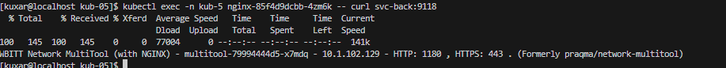

# kuber-05-net-2

#### Задание 1.

kubectl create namespace kub-5

kubectl apply -n kub-5 -f 1-*-*.yaml

kubectl -n kub-5 get * -o wide

kubectl exec -n kub-5 multitool-75fd6c99b4-vj8bd -- curl svc-front:9080

kubectl exec -n kub-5 nginx-85f4d9dcbb-4zm6k -- curl svc-back:9118

Манифесты:
[1-dep-back.yaml](yaml/1-dep-back.yaml),[1-dep-front.yaml](yaml/1-dep-front.yaml), [1-svc-back.yaml](yaml/1-svc-back.yaml),[1-svc-front.yaml](yaml/1-svc-front.yaml)

#### Задание 2.

microk8s enable ingress

kubectl apply -n kub-5 -f 2-ing-front.yaml 

kubectl -n kub-5 get ingress

kubectl -n kub-5 describe ingress 

curl http://localhost/

curl http://localhost/api

Манифесты:

[2-ing-front.yaml](yaml/2-ing-front.yaml)

Задание 1. Создать Deployment приложений backend и frontend
Создать Deployment приложения frontend из образа nginx с количеством реплик 3 шт.
Создать Deployment приложения backend из образа multitool.
Добавить Service, которые обеспечат доступ к обоим приложениям внутри кластера.
Продемонстрировать, что приложения видят друг друга с помощью Service.
Предоставить манифесты Deployment и Service в решении, а также скриншоты или вывод команды п.4.
Задание 2. Создать Ingress и обеспечить доступ к приложениям снаружи кластера
Включить Ingress-controller в MicroK8S.
Создать Ingress, обеспечивающий доступ снаружи по IP-адресу кластера MicroK8S так, чтобы при запросе только по адресу открывался frontend а при добавлении /api - backend.
Продемонстрировать доступ с помощью браузера или curl с локального компьютера.
Предоставить манифесты и скриншоты или вывод команды п.2.
